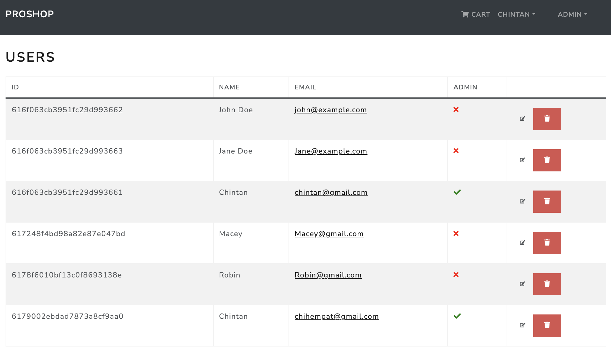

<!-- 
 -->

  <!-- <a href="https://proshop.netlify.app">Demo</a> -->
<!-- 
 -->

<h1 align="center">Proshop</h1>

## About ##

ProShop is an ecommerce platform that allows you to sell your products online.
It is work in progress and is still in development.

<!-- ## :sparkles: Features ##

:heavy_check_mark: Feature 1;\
:heavy_check_mark: Feature 2;\
:heavy_check_mark: Feature 3;  -->

## Technologies ##

Before starting, you need to install the following dependencies:

Inspired by <a href="https://twitter.com/traversymedia?ref_src=twsrc%5Egoogle%7Ctwcamp%5Eserp%7Ctwgr%5Eauthor" target="_blank">Brad Traversy
</a>

Made by <a href="https://github.com/{{chihempat}}" target="_blank">Chintan Patel</a>

&#xa0;

<a href="#top">Back to top</a>
